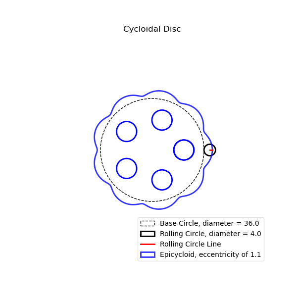

# cycloidal_drive

Working on a cycloidal drive system. This repo will include  latex documents with notes from my research and python code for creating the cycloidal drive.

Can create visualizations of the "rolling circle" used to make cycloid shape as seen below:

The different shape parameters can be varied to see their effects on the final cycloid disc.
Here's a final image from one run:

Some future goals for this project:
- Improve visualization
    - Potentially create 3D animations of a completed cycloidal drive in motion
- Refactor code base
- Improve testing