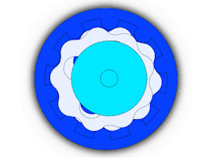
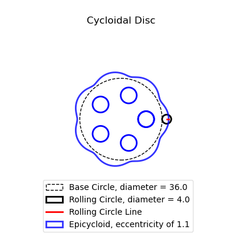

# Cycloidal Drive System

Working on a cycloidal drive system. This repo will include latex documents with notes from my research and python code for creating the cycloidal drive.

- See Latex PDF in /cycloidal_drive_tex/ for more details on equations and implementation

Can create visualizations of the "rolling circle" used to make cycloid shape as seen below:

The different shape parameters can be varied to see their effects on the final cycloid disc.
Here's a final image from one run:

- Added feature to create "Parametric Equations" for Solidworks "Equation Driven Curve" and add parameters
    - Can link the parameters text file to Solidworks to create "Global Variables" based on values set in script

Some future goals for this project:
- Improve visualization
    - Potentially create 3D animations of a completed cycloidal drive in motion
- Improve testing
